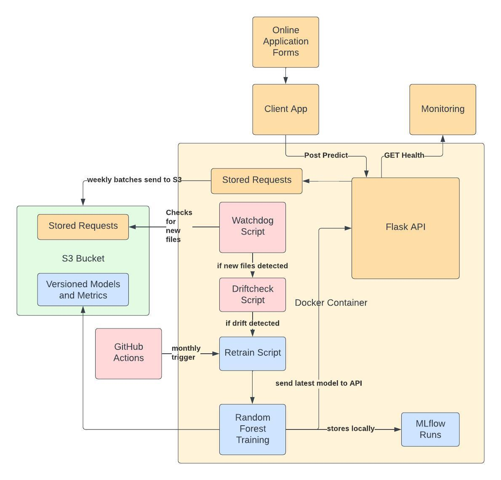

# Fraud Detection MLOps Project

This project implements a full MLOps workflow for a **fraud detection system**. It combines automated data ingestion, drift monitoring, retraining, experiment tracking, and API deployment in a **containerized environment** (Docker on EC2). MLflow is used for local experiment tracking and S3 is used as the model and metrics storage.

## Project Overview

The system is designed to:

- Automatically ingest **monthly CSV data** from S3.
- Monitor the data for **drift** and trigger retraining if needed.
- Train a **RandomForest classifier** with hyperparameters optimized for performance.
- Serve predictions via a **Flask API**.
- Track experiments, models, and metrics using **MLflow**.
- Backup models and metrics to **AWS S3**.
- Be fully containerized for **reproducibility and portability**.

This setup demonstrates a realistic production-like MLOps pipeline suitable for hands-on experimentation and deployment.

## Architecture

## Setup

1. Clone the repository  
   git clone <repo_url>  
   cd fraud-detectio-mlops

2. Prepare environment variables  
   Create a `.env` file in the project root:

   AWS_ACCESS_KEY_ID=YOUR_AWS_ACCESS_KEY_ID  
   AWS_SECRET_ACCESS_KEY=YOUR_AWS_SECRET_ACCESS_KEY  
   AWS_DEFAULT_REGION=eu-north-1  
   MLFLOW_TRACKING_URI=file:./mlruns  
   BUCKET_NAME=fraud-detection-project-data-science-2025  
   MONTHS_PREFIX=monthly_csv/  
   LATEST_MODEL_PATH=./model/model.pkl  

   *Replace `YOUR_AWS_ACCESS_KEY_ID` and `YOUR_AWS_SECRET_ACCESS_KEY` with your real AWS credentials.*

3. Build the Docker image  
   docker build -t fraud-detectio-mlops:latest .

4. Run the container  
   docker run -it --rm --env-file .env -p 8000:8000 -p 5001:5000 -v "$(pwd)/mlruns:/app/mlruns" fraud-detectio-mlops:latest

**Explanation:**  
- Port 8000: Flask API endpoints  
- Port 5001: MLflow UI for experiment tracking  
- Volume mount (`mlruns`): persists MLflow experiment data locally  

## Usage

**Flask API**  
- POST `/predict` → Get fraud prediction  
- GET `/health` → Check API health  

Example:  
curl -X POST http://localhost:8000/predict -H "Content-Type: application/json" -d '{"features": [0.1, 0.2, ...]}'

**MLflow UI**  
- Open http://localhost:5001 in your browser  
- Monitor experiments, metrics, and logged models  
- Visualize retraining runs and model performance  

## Notes

- The Drift Watchdog automatically monitors S3 for new monthly CSV files.  
- If drift is detected, the retraining pipeline runs and logs metrics to MLflow.  
- Models and metrics are backed up to S3 after each retraining.  
- Ensure your AWS credentials are valid and the specified S3 bucket exists.  
- This setup is intended for local development; for production, use a proper WSGI server and AWS environment.